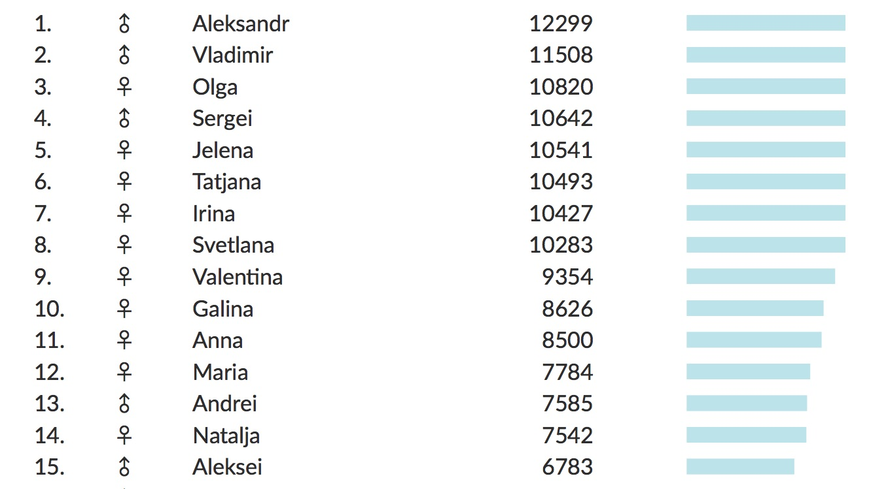

  

# Names of Estonia

The names of Estonia and the Russian influence. During the time I lived in Estonia, I become interested into the names of Estonia. I took the statistical naming data and presented them in a simple, searchable table. For further work, one could go over each name and look up the origin of it. With this kind of categorization, a more detailed analysis and presentation would be possible.

## Methodology

1. I scraped the names of the largest Estonian (publicly accessible) Facebook groups. Unified the results and extracted only the unique first names. See the folder [scraper_fist_names](scraper_first_names)
2. Scraped the results of http://www.stat.ee/public/apps/nimed/$FIRST-NAME for all the first names. See the folder [scraper](scraper).
3. Visualized the results on a simple (mobile first) web page. I used the build tool `Brunch`. See the folder [html](html).

## License

MIT.
